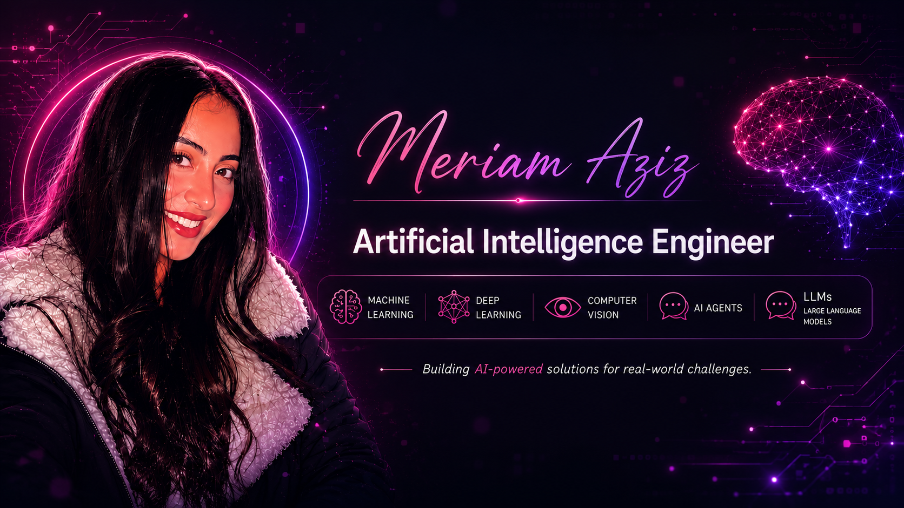

  

<h1 align="center">Hi 👋, I'm Meriam Aziz</h1>

<h3 align="center">🤖 AI Engineer | Computer Vision | LLMs | AI Agents</h3>

Passionate about building intelligent AI systems using Machine Learning, Deep Learning, Computer Vision, Large Language Models (LLMs), and AI Agents to solve real-world problems through automation, perception, and intelligent decision-making.

---

# 🌐 Connect with Me

---

# 🛠️ Languages & Technologies

- 🐍 Python
- 💻 C++
- 🔥 PyTorch
- 🧠 TensorFlow
- 👁️ OpenCV
- 🚀 YOLO
- 📊 Scikit-learn
- 🐼 Pandas
- 🔢 NumPy
- 📈 Matplotlib
- 🌐 Flask
- ⚡ Streamlit
- 🤖 OpenRouter API
- 🦜 LangChain
- 📚 FAISS
- ⚙️ LangGraph
- 🧠 MCP (Model Context Protocol)
- 🤖 AI Agents
- 💬 Large Language Models (LLMs)
- 🔀 Git & GitHub

---

# 🚀 Featured Projects

## 🩺 Machine Learning

- 🩺 **Diabetes Health Prediction** – Predict diabetes risk using health indicators and Machine Learning models.
- 🔐 **Malicious URL Detection** – Detect malicious URLs using feature engineering, Random Forest, and Gradient Boosting.

---

## 🧠 Deep Learning

- ✍️ **MNIST Handwritten Digit Recognition** – Deep learning model for handwritten digit classification.
- 🎙️ **Audio Deepfake Detection** – Detect manipulated audio using the SceneFake dataset.

---

## 👁️ Computer Vision

- 🚗 **Vehicle License Plate Recognition using OCR** – Automatic vehicle license plate detection and text recognition using OpenCV and EasyOCR.
- 🤟 **DeafBot (Graduation Project)** – AI-powered sign language recognition and communication system using YOLO, OpenCV, LLMs, and Text-to-Speech.

---

## 🤖 AI Agents & LLMs

- 🤖 **AIOS Multi-Agent System** – A modular multi-agent AI system that coordinates multiple intelligent agents to automate complex tasks using LLMs, LangChain, AI Agents, and modern agent orchestration techniques.

- 💬 **LLM Applications** – Developing intelligent assistants capable of reasoning, planning, retrieval, and real-time interaction using modern Agentic AI frameworks.

---

# 🌱 Currently Learning

- 🤖 AI Agents
- 💬 Large Language Models (LLMs)
- 📚 Retrieval-Augmented Generation (RAG)
- ⚙️ LangGraph
- 🧠 MCP (Model Context Protocol)
- ✨ Generative AI
- 👁️ Advanced Computer Vision

---

# 💡 Areas of Interest

- 🤖 Artificial Intelligence
- 🧠 Machine Learning
- 🎯 Deep Learning
- 👁️ Computer Vision
- 💬 Large Language Models (LLMs)
- 🤖 AI Agents
- 🔗 Agentic AI
- 📚 Retrieval-Augmented Generation (RAG)
- 🔐 AI for Cybersecurity
- 🎙️ Audio AI

---

# 📈 Current Focus

- 🚀 Building AI-powered applications with LLMs and AI Agents
- 🤖 Designing autonomous multi-agent systems
- 👁️ Developing Computer Vision solutions
- 🧠 Exploring Agentic AI, LangGraph, and MCP
- 💡 Creating AI solutions that solve real-world problems

---

⭐ **Thanks for visiting my GitHub profile!**

I'm always excited to learn new AI technologies, collaborate on impactful projects, and build intelligent solutions that make a difference.

I'm always excited to learn, build intelligent AI solutions, and collaborate on impactful projects in **Machine Learning, Deep Learning, Computer Vision, LLMs, and AI Agents.**

